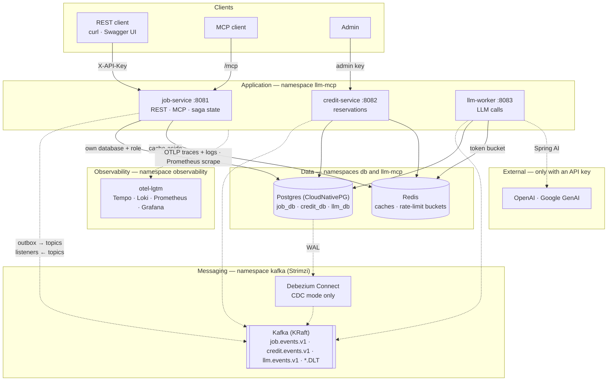
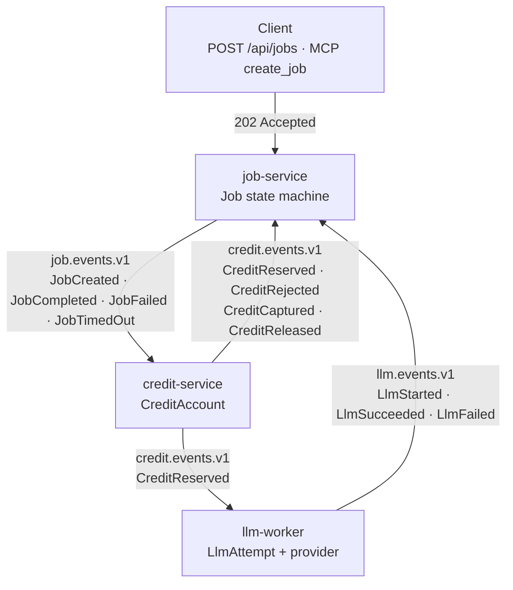
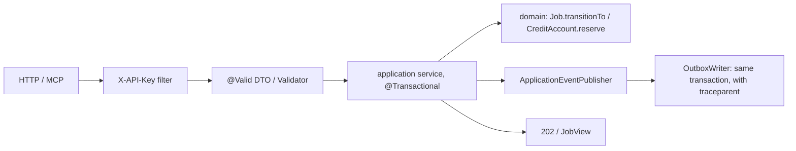
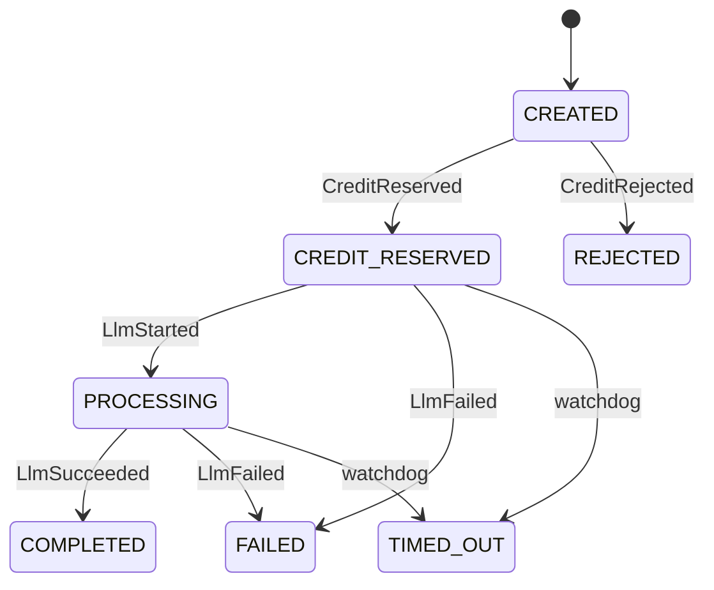
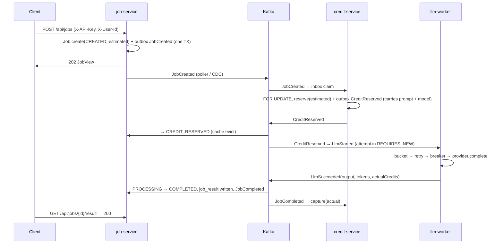

# LLM MCP Backend Architecture

> Code snapshot: 13 September 2026
> Primary sources: [`contracts/`](contracts/), [`services/`](services/), [`deploy/`](deploy/), [`infra/`](infra/), [`docs/runbook.md`](docs/runbook.md)
> Verified dependency versions: [`docs/verified-versions.md`](docs/verified-versions.md); day-to-day commands: [`docs/runbook.md`](docs/runbook.md)

## 1. Purpose, scope and how to read this document

This document describes the code that runs in the repository. Its goal is not to list folders but to
show how a request from a client (REST or MCP) — "run this prompt on this model" — travels through
credit reservation, the LLM call, result persistence and credit capture/release across three
services and three Kafka topics.

Four concepts are kept deliberately distinct:

- **Command (HTTP/MCP):** the surface `job-service` exposes; synchronous, ends with `202 Accepted`.
- **Domain event:** one of the 12 event types in the `contracts` module; the only way services talk.
- **Outbox row:** the event written to the service's own database in the same transaction as the
  business change. *When* it reaches Kafka is another component's job (poller or Debezium).
- **Inbox record:** a consumer's note "I already processed this event id"; deduplicates at-least-once delivery.

Only behaviour verified against the code is described here.

## 2. Executive summary

- The system is three Spring Boot 4 services (`job-service`, `credit-service`, `llm-worker`), one
  shared contracts module and a choreographed saga over Kafka (KRaft). There is no central
  orchestrator: each service consumes an event, updates its own tables and emits the next event.
- The only public API belongs to `job-service`: `POST /api/jobs` (202), `GET /api/jobs/{id}`,
  `GET /api/jobs/{id}/result`, `GET /api/jobs?status=`; the same use cases are exposed under `/mcp`
  as MCP tools, a resource and a prompt. `credit-service` only exposes balance reads and an admin top-up.
- Reliability rests on three patterns: the **transactional outbox** (event and business row in one
  commit), the **idempotent consumer / inbox** (`processed_event` table) and the **transition table**
  (7 states, 8 legal transitions; out-of-order events walk the path they imply, invalid ones are
  counted and ignored).
- Credits use a semantic lock: `balance` is not decremented on reservation, `reserved` grows;
  success `capture`s the actual cost (≤ estimate), failure/timeout `release`s. `available = balance − reserved` is always readable.
- The LLM side is a Strategy port (`LlmProvider`): `fake` (default, free, chaos hooks), `openai`,
  `gemini`; every call goes Redis token bucket → Resilience4j retry → circuit breaker → provider.
- Environments: Docker Compose (development), kind (Kubernetes with Strimzi + CloudNativePG), GKE
  Autopilot (CDKTN Java stacks; `cdktn synth` is verified, deploying was deliberately not done).
- CI/CD: a Buck2 target graph plus `rdeps(owner(changed files))` so only the affected modules are
  tested and only their images are pushed; rollout to GKE sits behind the `gke` environment approval.

## 3. System context

Two views, kept apart on purpose: **what runs where** (a C4-style container view: one level of
grouping, top-to-bottom, one arrow per relationship) and **how events move** (event flow). Putting
both on one picture is what made earlier versions unreadable.

### 3.1 Container view

Groups are the deployment boundaries: each group is a Kubernetes namespace on kind/GKE and a set
of containers on Docker Compose. Solid arrows are synchronous calls, dotted arrows are asynchronous.



### 3.2 Event flow

Commands enter only through `job-service`; everything after that is an event. Each service writes
the event to its own `outbox` table in the same transaction as its state change; the outbox poller
(or Debezium) puts it on Kafka; consumers deduplicate with their `processed_event` inbox. Topics are
the edge labels: three services, three topics, one direction each.



What each event does on arrival:

| Event | Consumer | Effect |
|---|---|---|
| `JobCreated` | credit-service | `SELECT … FOR UPDATE`, reserve the estimate → `CreditReserved` (carries prompt + model) or `CreditRejected` |
| `CreditReserved` | job-service | `CREATED → CREDIT_RESERVED` |
| `CreditReserved` | llm-worker | start an attempt → `LlmStarted`, call the provider → `LlmSucceeded` / `LlmFailed` |
| `CreditRejected` | job-service | `CREATED → REJECTED` |
| `LlmStarted` | job-service | `CREDIT_RESERVED → PROCESSING` |
| `LlmSucceeded` | job-service | `PROCESSING → COMPLETED`, write `job_result` → `JobCompleted` (or keep it as a late result if already `TIMED_OUT`) |
| `LlmFailed` | job-service | `→ FAILED` → `JobFailed` |
| watchdog (no event) | job-service | stuck longer than the timeout → `TIMED_OUT` → `JobTimedOut` |
| `JobCompleted` | credit-service | capture the actual cost, release the rest |
| `JobFailed`, `JobTimedOut` | credit-service | release the reservation |
| `CreditCaptured`, `CreditReleased` | — | informational (metrics, trail); no consumer changes state |

### 3.3 Trust boundaries

| Boundary | Identity / authentication | Note |
|---|---|---|
| Client → `job-service` `/api/**` | `X-API-Key` header; `APP_API_KEYS` → `ROLE_USER` | `X-User-Id` is not an identity, it selects the credit account |
| MCP client → `job-service` `/mcp` | open in the `local` profile (`app.security.mcp-open`), `ROLE_USER` elsewhere | any MCP host; `.mcp.json` holds the local registration |
| Admin → `credit-service` `POST /api/credits/{userId}/topup` | `APP_ADMIN_API_KEYS` → `ROLE_ADMIN` | 401/403 bodies are RFC 9457 `application/problem+json` |
| Anyone → `/actuator/health/**`, `/actuator/prometheus`, `/swagger-ui/**`, `/v3/api-docs/**` | open | every other actuator endpoint needs `ROLE_ADMIN` |
| Service ↔ Kafka | plain listener (kind/compose) | services never call each other over HTTP; events are the only channel |
| Service → Postgres | one role and one database per service (`job`, `credit`, `llm`) | no access to another service's tables |
| GitHub Actions → GCP | Workload Identity Federation, no keys | the `common` stack restricts the pool/provider to this repository |

## 4. Repository and runtime architecture

### 4.1 Top-level directories

| Directory | Responsibility |
|---|---|
| `contracts/` | Event envelope (`EventEnvelope`), 12 event records, JSON Schemas and fixtures; the ONLY module shared between services |
| `services/job-service/` | `Job` aggregate, saga state, REST + MCP surface, timeout watchdog |
| `services/credit-service/` | `CreditAccount` / `CreditReservation`, reserve–capture–release |
| `services/llm-worker/` | Provider adapters, resilience chain, `llm_attempt` trail |
| `e2e/` | Black-box saga tests against the running stack (`-Pe2e`) |
| `deploy/` | Compose init SQL, Debezium connector JSON, kind / Strimzi / CNPG / Kustomize / otel-lgtm manifests |
| `infra/` | CDKTN (Java) `common` + `main` stacks and the Kubernetes constructs |
| `tools/buck2/` | Buck2 prelude cell: `command` / `files` / `group` rules, Maven and CDKTN macros |
| `scripts/` | `smoke.sh`, `mcp-check.sh`, `k8s-secrets.sh`, `changed-targets.sh` |
| `.github/` | `push.yaml` (verify, images, deploy, e2e against the cluster), `pull_request.yaml` and the composite actions |

### 4.2 Inside a service (hexagonal-lite)

```text
services/<service>/src/main/java/com/remidosol/llmmcp/<pkg>/
├── api/             # inbound adapters: REST controllers, DTOs, ProblemDetail handler, (job) MCP server
├── application/     # use-case services, ports (application/port), read models, configuration properties
├── domain/          # JPA entity = aggregate, enums/values, transition table, domain event records
└── infrastructure/  # persistence (Spring Data), messaging (listener + DLT), inbox, outbox, cache, security, health, providers
```

ArchUnit (`architecture/HexagonalArchitectureTest`) enforces in every service at build time:
`domain` is framework-free, `api` and `application` never depend on `infrastructure`, Lombok only in
`domain`, Jackson 2 (`com.fasterxml`) is banned, `KafkaTemplate.send` exists only in the outbox publisher.

A typical command chain:



### 4.3 Technology

| Layer | Technology |
|---|---|
| Runtime | Java 21 (virtual threads on), Spring Boot 4.1, Spring Framework 7, Jackson 3 (`tools.jackson`) |
| Messaging | Spring Kafka 4.1, Apache Kafka 4.3 (KRaft), `StringSerializer` + contracts `JsonMapper`, `DefaultErrorHandler` + `DeadLetterPublishingRecoverer` |
| Persistence | PostgreSQL 17, Spring Data JPA, Flyway (`V1__init`, `V2__outbox_traceparent`, `R__seed_local`) |
| Cache / rate limit | Redis 8 (cache-aside, `transactionAware` eviction; Lua token bucket) |
| LLM | Spring AI 2.0 (OpenAI, Google GenAI), MCP Java SDK 2.0 (stateless Streamable HTTP) |
| Resilience | Resilience4j (retry + circuit breaker per provider) |
| Security | Spring Security 7, stateless, API-key filter |
| Observability | Micrometer + Prometheus, Micrometer Tracing / OpenTelemetry (OTLP traces + logs), `grafana/otel-lgtm` |
| CDC | Debezium 3.6 Postgres connector (`pgoutput`) + outbox `EventRouter` SMT |
| Tests | JUnit 5, Testcontainers (Postgres/Kafka/Redis; no H2), Awaitility, WireMock, ArchUnit |
| Images / Kubernetes | Jib, kind, Kustomize, Strimzi 1.2, CloudNativePG 1.30, KEDA (GKE) |
| IaC / CI | CDKTN 0.24 (Java) + OpenTofu, Buck2 task runner, GitHub Actions, mise |

### 4.4 Deployment topology

| Environment | Kafka | Postgres | Redis | Services | Observability |
|---|---|---|---|---|---|
| Compose (`make compose-up`) | `apache/kafka` single node, `kafka-init` creates topics, kafka-ui :8090 | `postgres:17` host :5433, `job_db/credit_db/llm_db` | :6380 | `make run-all` (JVMs, `local` profile) | `--profile observability` → otel-lgtm :3000/:4318 |
| kind (`make deploy-local`) | Strimzi `KafkaNodePool` + `Kafka` CR, 6 `KafkaTopic`s, kafka-ui | CNPG `Cluster pg` (ns `db`), 3 `Database`s + 3 roles | Deployment (ns `llm-mcp`) | Kustomize `deploy/k8s/overlays/local`, `:local` images, job-service NodePort :30080 | `make deploy-observability` (ns `observability`) |
| GKE Autopilot (`infra/`, not deployed) | same Strimzi CRs (operator via Helm) | same CNPG CRs | Deployment | CDKTN `main` stack: `SpringBootService` constructs, HPA (job/credit), KEDA lag scaler (worker) | `OtelLgtm` construct |

Every service pod: `startupProbe` (liveness path, 30 × 2 s), `livenessProbe` (NO dependency
checks), `readinessProbe` (`db`, `redis`, `kafka` components), `requests 500m/768Mi`,
`limits 1 CPU/1Gi`, `JAVA_TOOL_OPTIONS=-XX:MaxRAMPercentage=75`, `terminationGracePeriodSeconds: 30`.

## 5. Persistent data and state model

### 5.1 Tables (database per service)

| Database | Table | Owner | Note |
|---|---|---|---|
| `job_db` | `job` | job-service | aggregate; `status`, `estimated_credits`, `actual_credits`, `failure_reason`, `@Version` optimistic lock, `(status, updated_at)` index for the watchdog |
| `job_db` | `job_result` | job-service | LLM output, provider/model, token counts, `late` flag |
| `credit_db` | `credit_account` | credit-service | `balance`, `reserved`; updated under `SELECT … FOR UPDATE` |
| `credit_db` | `credit_reservation` | credit-service | `job_id UNIQUE` (reservation is idempotent), `status` RESERVED / CAPTURED / RELEASED |
| `llm_db` | `llm_attempt` | llm-worker | one row per delivery: `attempt_no`, `status` STARTED / SUCCEEDED / FAILED, tokens |
| all | `outbox` | each service | Debezium EventRouter column names (`id, aggregatetype, aggregateid, type, payload jsonb, created_at, published_at`) + `traceparent`; partial index on `published_at IS NULL` |
| all | `processed_event` | each service | PK `(event_id, consumer_group)`; the inbox |

### 5.2 Job state machine



- The 8 legal pairs live in the `JobTransitions` table; `Job.transitionTo` rejects anything else with `InvalidTransitionException`.
- **Out-of-order events:** `SagaPath.impliedPath` walks the path to the target state (e.g. `LlmSucceeded`
  arriving while `CREATED` becomes `CREDIT_RESERVED → PROCESSING → COMPLETED`). An event arriving in a
  terminal state is logged, counted (`saga.guard_rejected{from,to}`) and ignored.
- **Timeout:** `JobTimeoutWatchdog` (`@Scheduled`) locks jobs in `CREDIT_RESERVED/PROCESSING` older than
  `app.saga.job-timeout` (120 s in production, 20 s locally) with `FOR UPDATE SKIP LOCKED`, moves them to
  `TIMED_OUT` and emits `JobTimedOut`. A later `LlmSucceeded` is stored with `late=true`; the job stays
  `TIMED_OUT` and `GET /result` keeps answering 404.

### 5.3 Credit invariants

- `available = balance − reserved`; a reservation requires `available ≥ estimated` and runs under the row
  lock (`ReserveCreditConcurrencyTest`: 10 concurrent reservations → exactly one winner).
- Estimate: `max(1, ceil(len(prompt)/4) × multiplier)`; actual cost:
  `max(1, ceil((promptTokens + completionTokens)/10) × multiplier)`; multipliers `fake 1 / gemini 2 / openai 3`.
- `capture(actual)`: `reserved -= estimated`, `balance -= min(actual, estimated)`; `release`:
  `reserved -= estimated`. A reservation cannot be settled twice (`InvalidReservationStateException`).

## 6. Ingress and routing

### 6.1 REST (job-service :8081, credit-service :8082)

| Method | Path | Role | Behaviour |
|---|---|---|---|
| POST | `/api/jobs` | user | Body `{prompt (≤ 8000), model "^(openai\|gemini\|fake):.+"}`, header `X-User-Id`; 202 + `JobView(status=CREATED)`; `JobCreated` into the outbox |
| GET | `/api/jobs/{id}` | user | Redis cache-aside (`jobs`, TTL 60 s, evicted on every transition); 404 problem+json |
| GET | `/api/jobs/{id}/result` | user | 200 only while `COMPLETED`; otherwise 404 (`late` results are never served) |
| GET | `/api/jobs?status=&limit=` | user | `limit` 1–100 |
| GET | `/api/credits/{userId}` | user | `{balance, reserved, available}` (cached 5 s) |
| POST | `/api/credits/{userId}/topup` | admin | opens the account if it does not exist |

Error bodies are RFC 9457 through `spring.mvc.problemdetails`; validation is Spring Framework 7's
built-in handler-method validation (no class-level `@Validated`, on purpose).

### 6.2 MCP (job-service `/mcp`)

Stateless Streamable HTTP: every POST is an independent JSON-RPC 2.0 call, no session, no SSE —
replicas need no affinity. The surface was verified end to end with the MCP Inspector CLI
(`make mcp-check`: create → poll → read result → prompt) and, as a final smoke check, by driving the
same tools from Claude Code.

| Kind | Name | Description |
|---|---|---|
| tool | `create_job(userId, prompt, model)` | same `CreateJobService` as REST; same DTO validation via `Validator`; exceptions become `isError` tool results |
| tool | `get_job(jobId)` | `JobQueryService.getJob` |
| tool | `list_jobs(userId, status?, limit?)` | |
| resource | `job://{jobId}/result` | `application/json`; a JSON-RPC error until the job is completed |
| prompt | `compare_models(prompt, userId?, modelA?, modelB?)` | instructions to create → poll → read results for two models |
| completion | `compare_models` arguments | prefix match over `app.mcp.models` |

### 6.3 Points to verify before production

- `X-User-Id` is an unauthenticated header: identity comes from the API key, the account from the header — a key → user mapping is needed.
- MCP `create_job` takes `userId` as an argument; same boundary.

## 7. Internal async topology

| Topic | Partitions | Retention | Producer | Consumer (group) | Events |
|---|---|---|---|---|---|
| `job.events.v1` | 3 | 7 days | job-service outbox | credit-service (`credit-service`) | JobCreated, JobRejected, JobCompleted, JobFailed, JobTimedOut |
| `credit.events.v1` | 3 | 7 days | credit-service outbox | job-service (`job-service`), llm-worker (`llm-worker`) | CreditReserved, CreditRejected, CreditCaptured, CreditReleased |
| `llm.events.v1` | 3 | 7 days | llm-worker outbox | job-service | LlmStarted, LlmSucceeded, LlmFailed |
| `*.DLT` | 1 | 30 days | `DeadLetterPublishingRecoverer` | (manual) | poison records after 4 attempts with exponential backoff; `dlt.messages{topic}` |

Record contract:

- **Key** = `aggregateId` (job id) → every event of a job lands on the same partition, in order.
- **Headers** `eventType`, `eventId` (consumers pick the type without parsing JSON), `traceparent` (W3C trace context).
- **Value** = the `EventEnvelope` JSON: `eventId` (UUIDv7), `eventType`, `aggregateType`, `aggregateId`,
  `correlationId` (= job id), `causationId` (the triggering event), `producer`, `occurredAt`, `payload`.
  Unknown fields are ignored (tolerant reader), unknown `eventType`s are logged and skipped. Schemas
  live in `contracts/src/main/resources/schemas/`; the fixture compatibility test catches contract changes.
- **Publishing:** `app.outbox.publisher=polling` (default; `OutboxPoller` claims a batch every 500 ms
  with `FOR UPDATE SKIP LOCKED`, sends synchronously with `send().get()`, marks `published_at`) or `cdc`
  (Debezium reads the WAL; EventRouter routes `aggregatetype` → `<type>.events.v1`; the poller is off).
  The bytes on Kafka are identical in both modes.
- **Consuming:** every listener goes through `IdempotentHandler.handle(envelope, consumerGroup, handler)`:
  `insert into processed_event … on conflict do nothing` in the handler's transaction; a conflict means
  a duplicate and the handler is skipped (`inbox.duplicate`). A crash mid-handler rolls the claim back and
  the redelivery processes the event again. MDC `jobId` is set here.

## 8. Feature flows

### 8.1 Happy path: create a job → completed



`CreditReserved` carries the prompt and the model (event-carried state): the worker never asks job-service over HTTP.

### 8.2 Rejection and compensation paths

| Trigger | Chain | End state |
|---|---|---|
| Insufficient credits | `JobCreated` → `CreditRejected` → job `REJECTED` | no reservation |
| Provider error (`[FAIL]`, 4xx) | `LlmFailed(retryable=false, attempts)` → job `FAILED` → `JobFailed` → `release` | `reserved` given back |
| Transient error (`[FLAKY]`, 429/5xx) | Resilience4j retries 3× inside the same delivery; success → a single `LlmSucceeded`; exhausted → `LlmFailed(retryable=true)` | job `FAILED` → release |
| Provider too slow (`[SLOW]`) | watchdog → `TIMED_OUT` → `JobTimedOut` → `release`; a late `LlmSucceeded` is stored with `late=true` | job stays `TIMED_OUT` |
| Worker `kill -9` mid-call | inbox claim rolls back → redelivery → attempt #2; a single `LlmSucceeded` | one outcome |
| Worker `SIGTERM` (pod delete) | graceful shutdown finishes the in-flight call; no redelivery needed | one attempt |
| Same event delivered twice | `processed_event` conflict → skipped | unchanged |
| Kafka down for 60 s | outbox rows keep `published_at NULL`; the poller catches up on the next tick | zero loss |

### 8.3 The LLM call and the resilience chain

`ExecuteLlmJobService` runs inside the inbox transaction: `LlmProviders.forModel("provider:model")` →
`AttemptRecorder.start` (REQUIRES_NEW; `LlmStarted` into the outbox) → `ProviderGateway.call`:

1. `RedisTokenBucket.acquire(provider)` — a Lua script does refill + take atomically; after `max-wait`
   (5 s) the call is shed with `ratelimit.rejected{provider}` and a retryable failure.
2. `Retry` (max 3, exponential; only `LlmCallException.retryable`) OUTSIDE, `CircuitBreaker` (window 10,
   50 %, open 30 s) INSIDE: an open breaker ends the retry loop immediately with `CallNotPermittedException`.
3. Provider: `FakeProvider` (latency + `[FAIL]/[FLAKY]/[SLOW]` chaos, only with `failure-injection` on),
   `OpenAiProvider` / `GeminiProvider` (Spring AI `ChatModel`, SDK retries off, `max_tokens` capped at 512;
   beans exist only when the API key is configured).

Metrics: `llm.call{provider,outcome}` timer, `llm.tokens{provider,kind}`, `resilience4j_*`; breaker state in
`/actuator/health` (`management.health.circuitbreakers.enabled=true`).

### 8.4 Cache-aside

`GET /api/jobs/{id}` is `@Cacheable("jobs")` (60 s), `GET /api/credits/{userId}` (5 s). Eviction happens on
every state transition through `JobTransitionService` / `CreditCacheEvictor` and **after the transaction
commits** (`RedisCacheManager.transactionAware()`); evicting before the commit let a concurrent reader
re-cache the stale row for the whole TTL (observed in e2e) and was closed this way.

### 8.5 Trace context through the outbox

`OutboxWriter` stores the active span's `traceparent` in the row (`Propagator.inject`); `OutboxPoller`
sends inside `Propagator.extract` + `tracer.withSpan`, so the `KafkaTemplate` observation opens a child
span and writes the header; on the Debezium path the column is mapped with
`transforms.outbox.table.fields.additional.placement=…,traceparent:header:traceparent`. Listener
observation continues from the header. Result: the whole saga of a job is one Tempo trace (verified on
kind: 14 spans across the 3 services). Log lines carry the `[service,traceId,spanId,jobId]` prefix.

### 8.6 CDC (Debezium) mode

One slot per connector (`job_outbox`, `credit_outbox`, `llm_outbox`), `publication.autocreate.mode=filtered`,
`snapshot.mode=no_data` (rows written before the slot existed are NEVER published → cut over with an empty
outbox), heartbeat topics (`__debezium-heartbeat.<prefix>`) declared explicitly because
`auto.create.topics.enable=false`. Order for schema/SMT changes: migration → drain with the old placement → update the SMT.

### 8.7 Kubernetes lifecycle

`make kind-up && make kind-load && make deploy-local && make smoke-k8s`. `deploy-local` installs Strimzi
with Helm and CNPG from its manifest, waits for `Kafka` Ready and every `Database` `applied=true`
(otherwise the pods crash-loop on `database does not exist` until they self-heal), generates the Secrets
from `.env` with `scripts/k8s-secrets.sh` and applies the overlay. `make deploy-cdc` applies Connect + the
3 `KafkaConnector`s and switches the services to `APP_OUTBOX_PUBLISHER=cdc`.

## 9. Service catalogue

| Service | Port | Owns | Consumes | Produces | Key classes |
|---|---|---|---|---|---|
| job-service | 8081 | `Job`, `JobResult`, saga state, REST + MCP, watchdog | `credit.events.v1`, `llm.events.v1` | Job* events | `CreateJobService`, `SagaService`, `JobTransitions`, `SagaPath`, `JobTimeoutWatchdog`, `JobMcpServer`, `SecurityConfig` |
| credit-service | 8082 | `CreditAccount`, `CreditReservation` | `job.events.v1` | Credit* events | `ReserveCreditService`, `SettleCreditService`, `TopUpService`, `JobEventsListener` |
| llm-worker | 8083 | `LlmAttempt`, provider adapters | `credit.events.v1` | Llm* events | `ExecuteLlmJobService`, `LlmProviders`, `ResilientProviderCall`, `RedisTokenBucket`, `FakeProvider`, `RealProvidersConfig` |
| (shared shape) | — | outbox / inbox / DLT / health / tracing infrastructure, copied per service | | | `OutboxWriter`, `OutboxPoller`, `OutboxRetention`, `IdempotentHandler`, `KafkaErrorHandlingConfig`, `TraceContextCarrier`, `KafkaHealthIndicator` |

The infrastructure classes are deliberately duplicated in the three services: services share no code except `contracts`.

## 10. Critical development rules

### 10.1 Adding an event or a saga step

1. `contracts`: add the record + JSON Schema + fixture; register it in `EventTypes.PAYLOAD_TYPES`;
   `FixtureCompatibilityTest` must stay green. A breaking change is a new topic version (`*.v2`).
2. On the producer side: domain event → `<X>EventsOutboxListener` → `OutboxWriter`; never `KafkaTemplate.send` (ArchUnit catches it).
3. On the consumer side: the listener must go through `IdempotentHandler`; in job-service every state
   change goes through `JobTransitionService` / `SagaService` (transition table + cache evict).
4. New metric names go to `docs/runbook.md` / the dashboard; new properties to `application.yaml`, the
   k8s ConfigMap and the `SpringBootService` construct.

### 10.2 Contract and security checklist

- Prompts and results are never logged; the prompt travels in exactly one event payload (`CreditReserved`).
- Secrets come from `.env` (not in git), Kubernetes `Secret`s (generated by script / variables) and GitHub secrets; never from code or manifests.
- Flyway migrations are immutable; seed data is an `R__` (repeatable, idempotent) migration.
- Tests use Testcontainers (no H2) and Awaitility (no `Thread.sleep`).

## 11. Technical risks and debt visible in the code

- `X-User-Id` is not verified; there is no API key → user mapping.
- With several poller replicas `SKIP LOCKED` lets a newer row overtake an older one (per-aggregate order
  can break); the saga guards absorb it, but strict ordering holds only with one poller.
- Cache-aside keeps a millisecond window between "read from DB" and "write to cache" even after
  commit-time eviction; the TTL is the upper bound.
- `make deploy-cdc` diverges from the overlay with `kubectl set env` (demo only).
- Circuit-breaker state is per replica; only the token bucket is cluster-wide.
- `kubernetes_manifest` needs the CRDs at plan time; on a fresh GKE cluster the `main` stack applies in two steps.
- Without real provider keys the OpenAI/Gemini path is verified with WireMock only.
- kind (`overlays/local`) and GKE (`main` stack) express the app tier twice (Kustomize vs CDKTN); the base manifests are the source only for kind.

## 12. Quick tracing guide for onboarding

1. `make compose-up && make run-all && make smoke` — see the happy and `[FAIL]` paths with the event trail.
2. `contracts/.../EventEnvelope.java` and `schemas/` — the wire format.
3. `job-service/domain/JobTransitions.java` → `SagaPath.java` → `application/SagaService.java` — the state machine and its guards.
4. `credit-service/application/ReserveCreditService.java` — `FOR UPDATE` and the outbox in one transaction.
5. `llm-worker/infrastructure/resilience/ResilientProviderCall.java` + `ratelimit/RedisTokenBucket.java` — the call chain.
6. `infrastructure/outbox/OutboxPoller.java` and `inbox/IdempotentHandler.java` — the reliability core.
7. `job-service/api/mcp/JobMcpServer.java` — the MCP surface; `make mcp-check`.
8. `deploy/` + `make deploy-local` — Kubernetes; `infra/README.md` — GCP.
9. `BUCK` files + `scripts/changed-targets.sh` — how CI picks its targets.

## 13. Source accuracy note

This document describes behaviour verified against the code, the manifests and the running local
environments (Compose, kind). The GKE side is verified up to `cdktn synth`; it has not been deployed to
a real GCP project. Ports, versions and property names are authoritative in `docs/verified-versions.md`.
