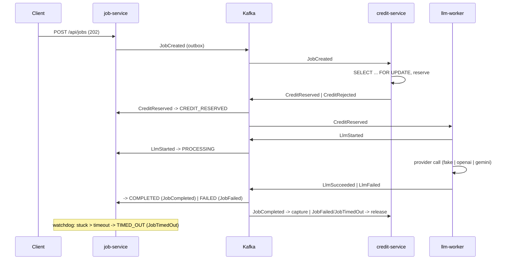

# llm-mcp

Credit-based LLM job pipeline — a learning-first, event-driven microservices project:
choreography saga, transactional outbox, Kafka (KRaft), Kubernetes, Spring AI 2.0 MCP.

Verified dependency versions and Boot 4 corrections are recorded in
[docs/verified-versions.md](docs/verified-versions.md); day-to-day commands in [docs/runbook.md](docs/runbook.md).

## Services

| Service | Port | Owns |
|---|---|---|
| job-service | 8081 | `Job` aggregate, saga state, public REST API, MCP server |
| credit-service | 8082 | `CreditAccount`, `CreditReservation` |
| llm-worker | 8083 | LLM execution, provider adapters, resilience |

## Quick start (Phase 1 scope)

```bash
# prerequisites: Docker, JDK 21 (the build enforces [21,26))
make compose-up      # kafka + kafka-ui (:8090) + postgres + redis
make run-job         # job-service on :8081 with the local profile

curl -X POST localhost:8081/api/jobs \
  -H 'X-API-Key: local-dev-key' -H 'X-User-Id: u1' -H 'Content-Type: application/json' \
  -d '{"prompt":"hello","model":"fake:demo"}'
```

OpenAPI UI: <http://localhost:8081/swagger-ui.html> · Kafka UI: <http://localhost:8090>

Every `/api` call needs `X-API-Key` (`APP_API_KEYS`, default `local-dev-key`); credit top-ups need an
admin key (`APP_ADMIN_API_KEYS`). The MCP server lives at `http://localhost:8081/mcp` (stateless
Streamable HTTP; open without a key in the `local` profile) — `.mcp.json` registers it for Claude Code,
`make mcp-tools` lists its tools via the MCP Inspector.

## Saga (choreography)



Every consumer runs through an inbox (`processed_event`), every producer through an outbox;
transitions are a table, out-of-order events walk their implied path, invalid ones are counted and ignored.
Run it: `make compose-up && make run-all && make smoke` (see [docs/runbook.md](docs/runbook.md)).

Architecture diagram and the full demo script arrive with Phase 8.
