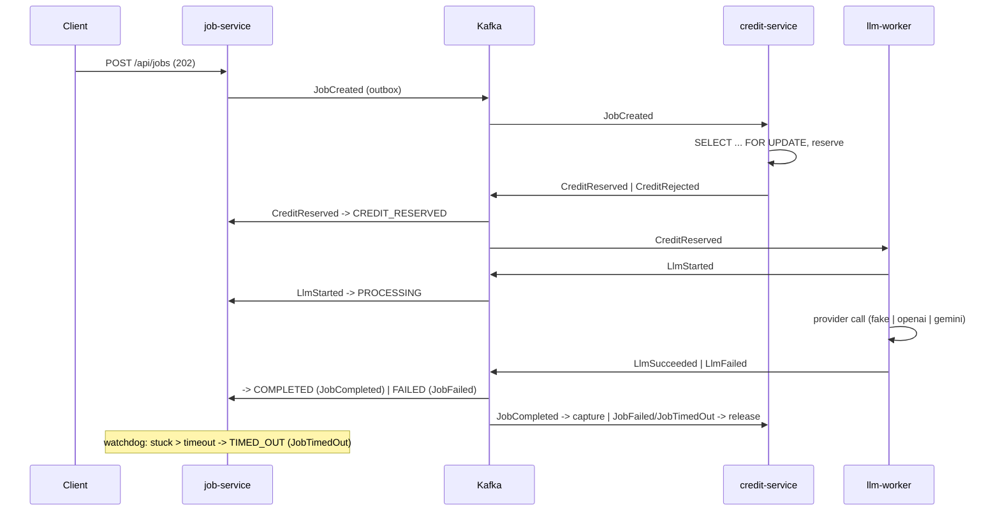

# llm-mcp

Credit-based LLM job pipeline — an event-driven microservices project built to be run, broken and
explained: choreography saga, transactional outbox, Kafka (KRaft), Kubernetes, MCP.

- Architecture (container view, event flow, data model, flows): [ARCHITECTURE.MD](ARCHITECTURE.MD)
- Day-to-day commands and troubleshooting: [docs/runbook.md](docs/runbook.md)
- Verified dependency versions and Boot 4 corrections: [docs/verified-versions.md](docs/verified-versions.md)

## Services

| Service | Port | Owns |
|---|---|---|
| job-service | 8081 | `Job` aggregate, saga state, public REST API, MCP server |
| credit-service | 8082 | `CreditAccount`, `CreditReservation` (reserve → capture / release) |
| llm-worker | 8083 | LLM execution, provider adapters (`fake`, `openai`, `gemini`), resilience |

## Quick start (Docker Compose)

Prerequisites: Docker Desktop, JDK 21 (the build enforces `[21,26)`), `make`. Optional: `mise install`
for pinned tools, `cp .env.example .env` for API keys.

```bash
make compose-up          # kafka (KRaft) + kafka-ui :8090 + postgres :5433 + redis :6380
make run-all             # the three services with the local profile, waits for readiness
make smoke               # one happy job + one [FAIL] job, credits before/after, the Kafka event trail
make stop-all && make compose-down
```

Manual calls (every `/api` call needs `X-API-Key`; local default keys: `local-dev-key`, admin `local-admin-key`):

```bash
curl -s -X POST localhost:8081/api/jobs \
  -H 'X-API-Key: local-dev-key' -H 'X-User-Id: u1' -H 'Content-Type: application/json' \
  -d '{"prompt":"Explain the outbox pattern in two sentences.","model":"fake:demo"}'
curl -s -H 'X-API-Key: local-dev-key' localhost:8081/api/jobs/<jobId>           # poll until COMPLETED
curl -s -H 'X-API-Key: local-dev-key' localhost:8081/api/jobs/<jobId>/result
curl -s -H 'X-API-Key: local-dev-key' localhost:8082/api/credits/u1             # balance / reserved / available
```

OpenAPI UI: <http://localhost:8081/swagger-ui.html> (Authorize with the key) · Kafka UI: <http://localhost:8090>.
The `fake` provider is the default and costs nothing; `openai:*` / `gemini:*` models work only when
`OPENAI_API_KEY` / `GOOGLE_API_KEY` are set in `.env` (max 512 tokens per call).

## Quick start (Kubernetes with kind)

Prerequisites: the above plus `kind`, `kubectl`, `helm`, and ~8 GB for Docker.

```bash
make kind-up             # kind cluster llm-mcp (host :30080 -> job-service)
make kind-load           # Jib images + Debezium Connect image into the cluster
make deploy-local        # Strimzi + CloudNativePG operators, Kafka, Postgres, secrets from .env, the services
make smoke-k8s           # the same smoke test through port-forwards
make deploy-observability && make grafana   # otel-lgtm; Grafana at :3000 (saga dashboard, Tempo, Loki)
make kind-down
```

## Demo script

1. `make compose-up && make run-all` (or the kind flow above).
2. Create a job for `u1` (above); watch `GET /api/jobs/{id}` go `CREATED → CREDIT_RESERVED → PROCESSING → COMPLETED`;
   compare `GET /api/credits/u1` before and after (`reserved` goes up, then `balance` goes down by the actual cost).
3. Kafka UI: the same `jobId` as the key on `job.events.v1`, `credit.events.v1`, `llm.events.v1`, with the
   `eventType` / `eventId` / `traceparent` headers.
4. A prompt starting with `[FAIL]` → `FAILED`, `CreditReleased`, balances reconcile.
5. A prompt starting with `[SLOW]` → after the 120 s watchdog: `TIMED_OUT`, release, then (~150 s) the late result
   stored with `late=true` and never served by `/result`.
6. MCP: `make mcp-check` — `create_job`, `get_job`, `job://{id}/result`, `compare_models` through the MCP Inspector CLI.
7. Grafana: the saga dashboard, one trace across the three services, breaker state (`make grafana`).
8. `kubectl -n llm-mcp delete pod -l app=llm-worker` mid-job — the job still ends with exactly one outcome.

## How it works, in one paragraph

Every consumer goes through an inbox (`processed_event`), every producer through an outbox row written
in the same transaction as the state change, and every job state change through a transition table
(7 states, 8 legal transitions). Out-of-order events walk the path they imply; invalid ones are counted
and ignored. Credits use a semantic lock (`balance` / `reserved`), the worker calls providers through a
Redis token bucket, Resilience4j retry and a circuit breaker, and the trace context rides through the
outbox so one Tempo trace shows the whole saga. Details: [ARCHITECTURE.MD](ARCHITECTURE.MD).



## What each technology does here

Every piece was chosen for a concrete job in this pipeline, not for the résumé. Where a simpler
alternative would have done, the table says what the extra component buys.

| Technology | Role in this project | What it buys over the simpler option |
|---|---|---|
| Java 21 + Spring Boot 4.1 | The three services: virtual threads for blocking JDBC/HTTP code, records for events and DTOs, `@Transactional` boundaries, Actuator probes and Prometheus metrics | One framework covers web, data, messaging, security and health; virtual threads give event-loop scalability without async APIs |
| Spring Data JPA + Flyway + PostgreSQL 17 | One database and one role per service (`job_db`, `credit_db`, `llm_db`); `SELECT … FOR UPDATE` for credit reservations, `@Version` optimistic locking on jobs, immutable migrations | Row locks and transactions are the money-safety mechanism; a shared database would silently couple the services |
| Apache Kafka 4.3 (KRaft) + Spring Kafka | Three topics, key = job id, so every event of a job stays ordered on one partition; consumer groups per service; `DefaultErrorHandler` + dead-letter topics for poison records | Durable, replayable, ordered delivery between services with no HTTP coupling; a REST call chain could not survive a consumer being down for a minute |
| Transactional outbox (poller and Debezium CDC) | The event row is written in the same transaction as the state change; a poller (`FOR UPDATE SKIP LOCKED`) or Debezium reading the WAL moves it to Kafka | Closes the dual-write gap: no lost events on a crash between commit and publish. CDC removes the polling load and shows the same bytes reach Kafka either way |
| Inbox (`processed_event`) + transition table | Every consumer claims the event id inside its own transaction; every job state change is checked against 7 states / 8 transitions | At-least-once delivery becomes effectively-once; out-of-order events walk the implied path instead of corrupting state |
| Redis 8 | Cache-aside for hot reads (`GET /api/jobs/{id}`, balances) with commit-time eviction; a Lua token bucket for provider rate limits | Rate limits are per provider account, so they must be cluster-wide: one bucket for all worker replicas. Cache eviction after commit closed a real stale-read race |
| Resilience4j | Retry (only retryable errors) outside a circuit breaker (10-call window, 50 %, open 30 s) around every provider call | Turns a 429 storm into three tries in one delivery instead of Kafka redeliveries, and stops calling a dead provider at all; verified with WireMock |
| Spring AI 2.0 + MCP Java SDK | Provider adapters (`fake`, OpenAI, Gemini) behind one `LlmProvider` port; the job API exposed as MCP tools, a resource and a prompt over stateless Streamable HTTP | The same use cases serve REST and an LLM client without duplicated logic; stateless MCP needs no session affinity across replicas |
| Spring Security (API key) | `X-API-Key` → `ROLE_USER` / `ROLE_ADMIN`, stateless, RFC 9457 error bodies | The minimum that makes the admin top-up and the actuator endpoints not public |
| Testcontainers, Awaitility, WireMock, ArchUnit | Real Postgres/Kafka/Redis in every integration test (no H2), polling assertions instead of sleeps, a fake OpenAI upstream, architecture rules enforced at build time | The tests exercise the same locking, serialization and dialect as production; ArchUnit keeps `KafkaTemplate.send` out of everything but the outbox publisher |
| Jib | Service images straight from Maven, no Dockerfile, no Docker daemon needed to push | Reproducible layered images, arm64 for kind and amd64 for GKE from one command |
| Kubernetes (kind locally, GKE Autopilot in the cloud) | Deployments with startup/liveness/readiness probes, resource limits sized for the JVM, graceful shutdown; NodePort on kind, HPA and KEDA lag scaling on GKE | Restarts, rollouts and scaling become declarative; the readiness-vs-liveness split and pod-delete chaos exercises are only observable here |
| Strimzi 1.2 + CloudNativePG 1.30 | Kafka (node pools, topics, Connect + Debezium connectors) and Postgres (cluster, roles, databases) as custom resources reconciled by operators | Stateful services on Kubernetes without hand-written StatefulSets; the same YAML runs on kind and, through the CDKTN main stack, on GKE |
| Kustomize (kind) / CDK Terrain in Java (GKE) | Base manifests + a local overlay for kind; typed `common` and `main` stacks with Kubernetes constructs for GKE, applied with OpenTofu | Kustomize is enough for one laptop cluster; the cloud tier needs the GCP foundation (cluster, registry, WIF, optional Shared VPC) and the app tier in one dependency graph, in the project's language |
| OpenTelemetry + `grafana/otel-lgtm` | OTLP traces and logs from all three services, Prometheus scrape, a saga dashboard; the `traceparent` rides through the outbox row and the Kafka header | One Tempo trace shows a whole saga across services and topics; without the outbox hop the trace would break at every publish |
| Buck2 (task runner) + GitHub Actions + mise | `BUCK` files declare what each step reads and writes; `rdeps(owner(changed files))` picks the affected targets; a service's `:docker` target is tests then a branch-tagged push; workflows are a handful of `buck2` commands; `mise` pins every tool | CI does the minimum a change requires without duplicating the dependency graph in YAML; a contracts change rebuilds every service, a docs change builds nothing |
| Workload Identity Federation + Artifact Registry digests | GitHub's OIDC token exchanged for a short-lived GCP credential; images pushed as `<service>:<branch>`, the main stack pins the digest behind the tag at apply time | No service-account keys in the repository or in secrets; deployments are digest-pinned even though the tag is mutable |

## Build, test, CI

```bash
./mvnw -B verify                      # everything: unit + integration (Testcontainers) + ArchUnit
./mvnw -pl services/job-service -am verify
make e2e                              # black-box saga tests against the running stack
buck2 targets //... && make changed BASE=<sha>   # the Buck2 target graph and what a diff affects
```

The build graph lives in `BUCK` files (Buck2 as a task runner). A service's `:docker` target is its
tests followed by a Jib push under the branch tag (`job-service:main`); the main stack resolves that
tag to a digest at apply time. So `push.yaml` (manual trigger until the cloud path is exercised) is three commands: `buck2 build` the targets the push
affects (`rdeps(//..., owner(<changed files>))`), `buck2 run //infra:apply@{common,main}` after
approval on the `gke` environment (Workload Identity Federation, no keys), then the e2e suite against
the rolled-out cluster. `pull_request.yaml` builds and pushes the affected images under the PR branch
tag, comments the OpenTofu plan of both stacks against the base branch, and posts a changelog;
`mise.toml` pins the tools.

## Cloud (GKE Autopilot)

Infrastructure is CDK Terrain Java code in [`infra/`](infra/README.md): a `common` stack (Autopilot
cluster, Artifact Registry, WIF deployer, optional Cloud SQL) and a `main` stack (operators, Kafka and
Postgres CRs, the services, autoscaling, observability) built from typed Kubernetes constructs.
`make infra-synth` renders both without credentials; deploying is a manual, paid step described in the runbook.
