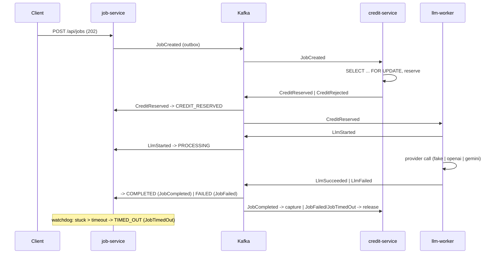

# llm-mcp

Credit-based LLM job pipeline — an event-driven microservices project built to be run, broken and
explained: choreography saga, transactional outbox, Kafka (KRaft), Kubernetes, MCP.

- Architecture (container view, event flow, data model, flows): [ARCHITECTURE.MD](ARCHITECTURE.MD)
- Day-to-day commands and troubleshooting: [docs/runbook.md](docs/runbook.md)
- Verified dependency versions and Boot 4 corrections: [docs/verified-versions.md](docs/verified-versions.md)

## Services

| Service | Port | Owns |
|---|---|---|
| job-service | 8081 | `Job` aggregate, saga state, public REST API, MCP server |
| credit-service | 8082 | `CreditAccount`, `CreditReservation` (reserve → capture / release) |
| llm-worker | 8083 | LLM execution, provider adapters (`fake`, `openai`, `gemini`), resilience |

## Quick start (Docker Compose)

Prerequisites: Docker Desktop, JDK 21 (the build enforces `[21,26)`), `make`. Optional: `mise install`
for pinned tools, `cp .env.example .env` for API keys.

```bash
make compose-up          # kafka (KRaft) + kafka-ui :8090 + postgres :5433 + redis :6380
make run-all             # the three services with the local profile, waits for readiness
make smoke               # one happy job + one [FAIL] job, credits before/after, the Kafka event trail
make stop-all && make compose-down
```

Manual calls (every `/api` call needs `X-API-Key`; local default keys: `local-dev-key`, admin `local-admin-key`):

```bash
curl -s -X POST localhost:8081/api/jobs \
  -H 'X-API-Key: local-dev-key' -H 'X-User-Id: u1' -H 'Content-Type: application/json' \
  -d '{"prompt":"Explain the outbox pattern in two sentences.","model":"fake:demo"}'
curl -s -H 'X-API-Key: local-dev-key' localhost:8081/api/jobs/<jobId>           # poll until COMPLETED
curl -s -H 'X-API-Key: local-dev-key' localhost:8081/api/jobs/<jobId>/result
curl -s -H 'X-API-Key: local-dev-key' localhost:8082/api/credits/u1             # balance / reserved / available
```

OpenAPI UI: <http://localhost:8081/swagger-ui.html> (Authorize with the key) · Kafka UI: <http://localhost:8090>.
The `fake` provider is the default and costs nothing; `openai:*` / `gemini:*` models work only when
`OPENAI_API_KEY` / `GOOGLE_API_KEY` are set in `.env` (max 512 tokens per call).

## Quick start (Kubernetes with kind)

Prerequisites: the above plus `kind`, `kubectl`, `helm`, and ~8 GB for Docker.

```bash
make kind-up             # kind cluster llm-mcp (host :30080 -> job-service)
make kind-load           # Jib images + Debezium Connect image into the cluster
make deploy-local        # Strimzi + CloudNativePG operators, Kafka, Postgres, secrets from .env, the services
make smoke-k8s           # the same smoke test through port-forwards
make deploy-observability && make grafana   # otel-lgtm; Grafana at :3000 (saga dashboard, Tempo, Loki)
make kind-down
```

## Demo script

1. `make compose-up && make run-all` (or the kind flow above).
2. Create a job for `u1` (above); watch `GET /api/jobs/{id}` go `CREATED → CREDIT_RESERVED → PROCESSING → COMPLETED`;
   compare `GET /api/credits/u1` before and after (`reserved` goes up, then `balance` goes down by the actual cost).
3. Kafka UI: the same `jobId` as the key on `job.events.v1`, `credit.events.v1`, `llm.events.v1`, with the
   `eventType` / `eventId` / `traceparent` headers.
4. A prompt starting with `[FAIL]` → `FAILED`, `CreditReleased`, balances reconcile.
5. A prompt starting with `[SLOW]` → after the 120 s watchdog: `TIMED_OUT`, release, then (~150 s) the late result
   stored with `late=true` and never served by `/result`.
6. MCP: `make mcp-check` — `create_job`, `get_job`, `job://{id}/result`, `compare_models` through the MCP Inspector CLI.
7. Grafana: the saga dashboard, one trace across the three services, breaker state (`make grafana`).
8. `kubectl -n llm-mcp delete pod -l app=llm-worker` mid-job — the job still ends with exactly one outcome.

## How it works, in one paragraph

Every consumer goes through an inbox (`processed_event`), every producer through an outbox row written
in the same transaction as the state change, and every job state change through a transition table
(7 states, 8 legal transitions). Out-of-order events walk the path they imply; invalid ones are counted
and ignored. Credits use a semantic lock (`balance` / `reserved`), the worker calls providers through a
Redis token bucket, Resilience4j retry and a circuit breaker, and the trace context rides through the
outbox so one Tempo trace shows the whole saga. Details: [ARCHITECTURE.MD](ARCHITECTURE.MD).



## Build, test, CI

```bash
./mvnw -B verify                      # everything: unit + integration (Testcontainers) + ArchUnit
./mvnw -pl services/job-service -am verify
make e2e                              # black-box saga tests against the running stack
buck2 targets //... && make changed BASE=<sha>   # the Buck2 target graph and what a diff affects
```

The build graph lives in `BUCK` files (Buck2 as a task runner): `push.yaml` computes which targets a
push affects (`rdeps(//..., owner(<changed files>))`), verifies them, pushes only the affected service
images to Artifact Registry with the commit sha (Jib, no Docker), and after approval on the `gke`
environment applies the CDKTN stacks over Workload Identity Federation (no keys). `pull_request.yaml`
verifies, synthesizes and posts a changelog; `mise.toml` pins the tools.

## Cloud (GKE Autopilot)

Infrastructure is CDK Terrain Java code in [`infra/`](infra/README.md): a `common` stack (Autopilot
cluster, Artifact Registry, WIF deployer, optional Cloud SQL) and a `main` stack (operators, Kafka and
Postgres CRs, the services, autoscaling, observability) built from typed Kubernetes constructs.
`make infra-synth` renders both without credentials; deploying is a manual, paid step described in the runbook.
