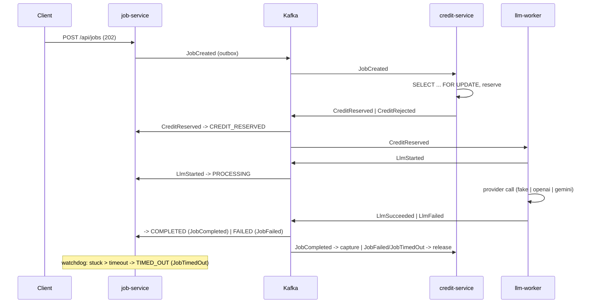

# llm-mcp

Credit-based LLM job pipeline — a learning-first, event-driven microservices project:
choreography saga, transactional outbox, Kafka (KRaft), Kubernetes, Spring AI 2.0 MCP.

Verified dependency versions and Boot 4 corrections are recorded in
[docs/verified-versions.md](docs/verified-versions.md); day-to-day commands in [docs/runbook.md](docs/runbook.md).

## Services

| Service | Port | Owns |
|---|---|---|
| job-service | 8081 | `Job` aggregate, saga state, public REST API, MCP server |
| credit-service | 8082 | `CreditAccount`, `CreditReservation` |
| llm-worker | 8083 | LLM execution, provider adapters, resilience |

## Quick start (Phase 1 scope)

```bash
# prerequisites: Docker, JDK 21 (the build enforces [21,26))
make compose-up      # kafka + kafka-ui (:8090) + postgres + redis
make run-job         # job-service on :8081 with the local profile

curl -X POST localhost:8081/api/jobs \
  -H 'X-API-Key: local-dev-key' -H 'X-User-Id: u1' -H 'Content-Type: application/json' \
  -d '{"prompt":"hello","model":"fake:demo"}'
```

OpenAPI UI: <http://localhost:8081/swagger-ui.html> · Kafka UI: <http://localhost:8090>

Every `/api` call needs `X-API-Key` (`APP_API_KEYS`, default `local-dev-key`); credit top-ups need an
admin key (`APP_ADMIN_API_KEYS`). The MCP server lives at `http://localhost:8081/mcp` (stateless
Streamable HTTP; open without a key in the `local` profile) — `.mcp.json` registers it for Claude Code,
`make mcp-tools` lists its tools via the MCP Inspector.

## Saga (choreography)



Every consumer runs through an inbox (`processed_event`), every producer through an outbox;
transitions are a table, out-of-order events walk their implied path, invalid ones are counted and ignored.
Run it: `make compose-up && make run-all && make smoke` (see [docs/runbook.md](docs/runbook.md)).

## Kubernetes (kind)

```bash
make kind-up && make kind-load && make deploy-local && make smoke-k8s
```

Strimzi 1.2 (KRaft, node pools) for Kafka, CloudNativePG 1.30 for Postgres (one cluster, three
databases), Redis, and the three services built with Jib and deployed with Kustomize
(`deploy/k8s/base` + `overlays/local|gke`). Secrets are generated from `.env` by
`scripts/k8s-secrets.sh`; nothing sensitive is committed. Details in [docs/runbook.md](docs/runbook.md).

## CI/CD and cloud (GitHub Actions, GKE Autopilot)

The build graph lives in `BUCK` files (Buck2 as a task runner, ADR-0027): `push.yaml` computes which
targets a push affects (`rdeps(//..., owner(<changed files>))`), verifies them, pushes only the
affected service images to Artifact Registry with the commit sha (Jib, no Docker), and after approval
on the `gke` environment applies the CDKTN stacks over Workload Identity Federation (no keys).
`pull_request.yaml` verifies and synthesizes; `mise.toml` pins the tools. Infrastructure is CDK Terrain Java code in [`infra/`](infra/README.md):
a `common` stack (Autopilot cluster, registry, WIF, optional Cloud SQL) and a `main` stack (operators,
Kafka/Postgres CRs, the services, autoscaling, observability) built from typed Kubernetes constructs —
`make infra-synth` renders both, deploying is a manual, paid step.

## Observability

`spring-boot-starter-opentelemetry` pushes traces and logs over OTLP to `grafana/otel-lgtm`
(compose profile `observability`, or `make deploy-observability` on kind); metrics are scraped
from `/actuator/prometheus`. The trace context rides through the outbox (`traceparent` column →
Kafka header), so one Tempo trace shows the whole saga across the three services.

Architecture diagram and the full demo script arrive with Phase 8.
